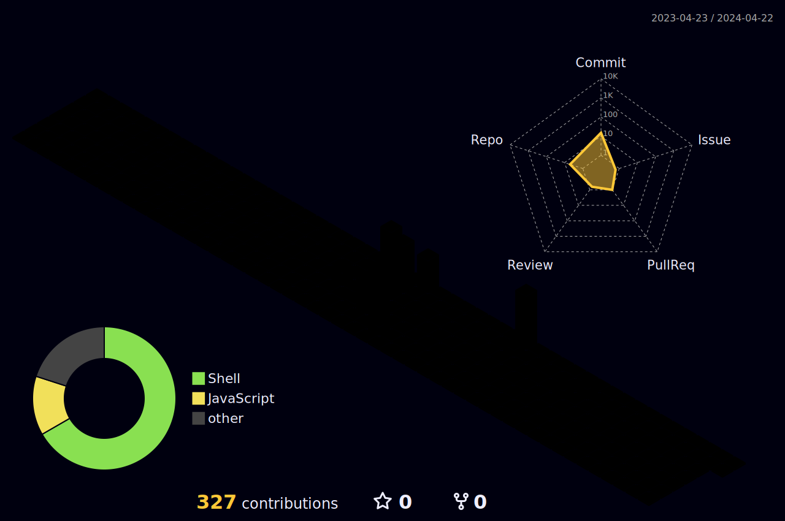

<!-- header -->

<!-- /header -->
### Hi there 👋
<ul>
  <li> 🔭 I’m currently trying to get into industry</li>
  <li>🌱 I’m currently learning Fullstack </li>
  <li>👯 I’m looking to collaborate on community projects</li>
 </ul>
 
  
<h3>Skills</h3>

  <a href="https://skillicons.dev">
    
    <!--  -->
  </a>

  

  
<b>:gear: &nbsp;Git statistics</b>

  
<!--This GitHub Action creates a GitHub contribution calendar on a 3D profile image.  ref -> https://github.com/yoshi389111/github-profile-3d-contrib -->
  
 <!-- -->

<!--
**nusakakalan/nusakakalan** is a ✨ _special_ ✨ repository because its `README.md` (this file) appears on your GitHub profile.

Here are some ideas to get you started:

- 🔭 I’m currently working on ...
- 🌱 I’m currently learning ...
- 👯 I’m looking to collaborate on ...
- 🤔 I’m looking for help with ...
- 💬 Ask me about ...
- 📫 How to reach me: ...
- 😄 Pronouns: ...
- ⚡ Fun fact: ...
-->
