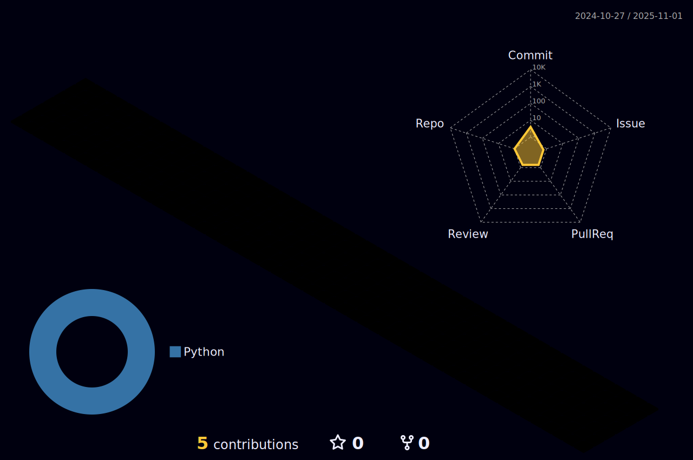

### Hi there 👋
<ul>
  <li> 🔭 I’m currently trying to get into industry</li>
  <li>🌱 I’m currently learning Fullstack </li>
  <li>👯 I’m looking to collaborate on community projects</li>
 </ul>
 
  
<h2>Skills</h2>

  

  

  
<b>:gear: &nbsp;Git statistics</b>

  
  

<!--
**nusakakalan/nusakakalan** is a ✨ _special_ ✨ repository because its `README.md` (this file) appears on your GitHub profile.

Here are some ideas to get you started:

- 🔭 I’m currently working on ...
- 🌱 I’m currently learning ...
- 👯 I’m looking to collaborate on ...
- 🤔 I’m looking for help with ...
- 💬 Ask me about ...
- 📫 How to reach me: ...
- 😄 Pronouns: ...
- ⚡ Fun fact: ...
-->
